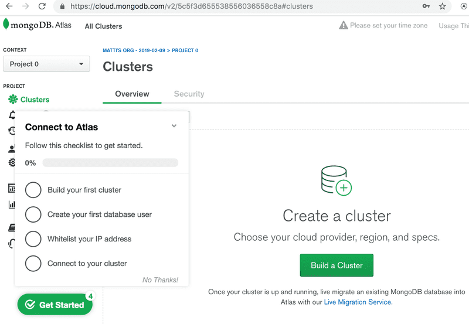
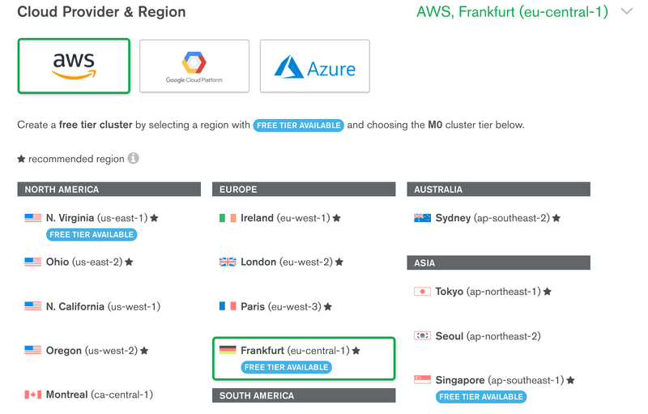
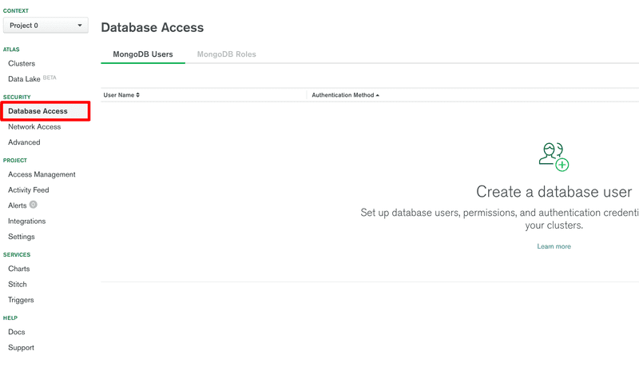
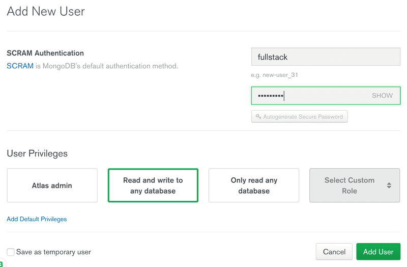
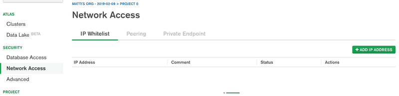
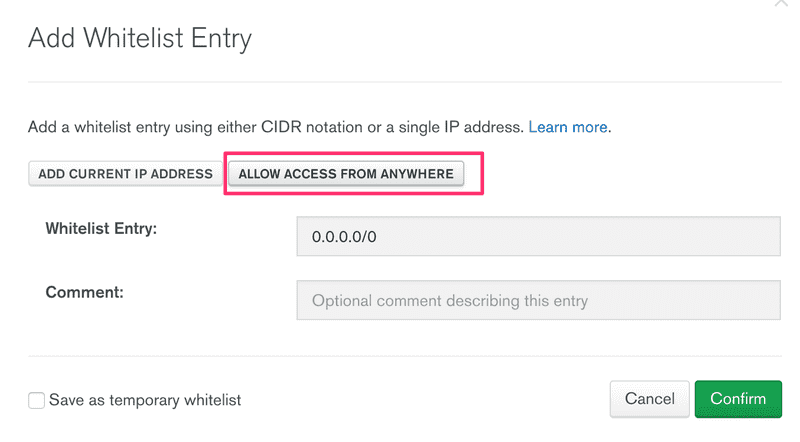
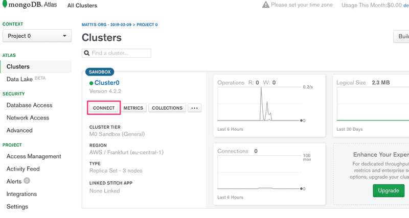
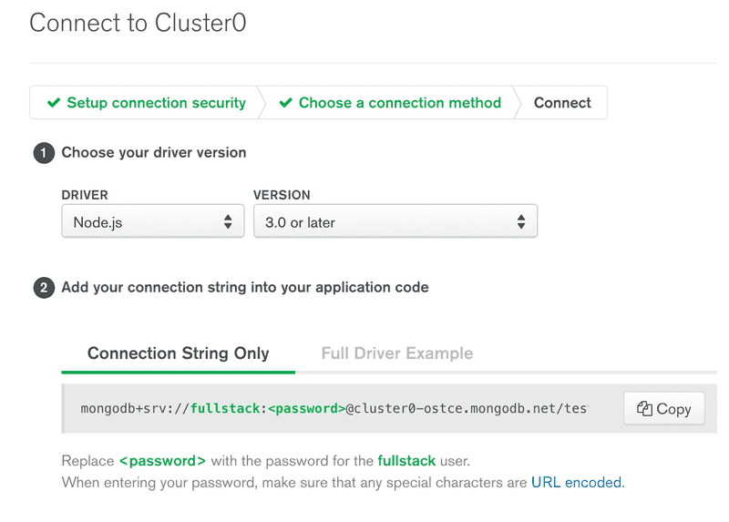

# Atlas Guide

## Table Of Contents
* [Sign Up](#Sign%20Up)
* Step 2

## Sign Up
* Enter [MongoDB Atlas](https://www.mongodb.com/cloud/atlas) and sign up.
* You can use either your google account and sign up with a new one.

## Starting A Cluster
* Once you've created and logged into your account, Atlas will recommend creating a cluster: 

* Choose AWS as the provider and Frankfurt as the region, and create a cluster.
You can choose whatever you prefer, its just for example.


* Wait for the cluster to be ready for use. This can take up to 10 minutes.

* Use the database access tab for creating user credentials for the database. Please note that these are not the same credentials you use for logging into MongoDB Atlas. These will be used for your application to connect to the database.


* Grant the user with permissions to read and write to the databases.


* You have to define the IP addresses that are allowed access to the database.


* For this guide you allow access from all IP addresses:


* To connect to the database start by clicking connect:


* And choose Connect your application:


* The view displays the MongoDB URI, which is the address of the database that we will supply to the MongoDB client library we will add to our application.

* The address looks like this:
``` Javascript
 mongodb+srv://<ACCOUNT>:<PASSWORD>@cluster0-ostce.mongodb.net/<DOC>?retryWrites=true 

```
* Now you just need to add it to your backend, Usually used with Mongoose repo.
