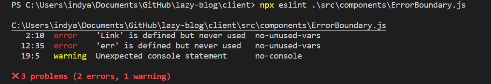

# Project Mannagment  
Here you'll find nice tools and content that will help you plan and make your project better.

## Table of Contents

* [Linting](#linting)

* [Linting React](#linting-react)

* [Gif making](#gif-maker)

* [Before you start coding](#before-you-start-coding)

## Linting
* [ESlint6](https://www.npmjs.com/package/eslint)  
The official code linter of our course.  
I really recommend using this [short walk through](https://www.youtube.com/watch?v=mfGkKlMDfwQ) to install eslint, but for those in a hurry I noted the basics below<br/>
### Basic installation guide

Download the package using
 ````
 npm install eslint --save-dev  
 ````
When the package is installed, run the snippet below, which will start configuratin

### !!! Linting React !!!
note that using ESLint in a `create-react-app` project requires a bit of a different approach. Use this [helpful guide](./linting/eslintForCRA.md )
 ```
 eslint --init  
 ```
Answer the several question using your common sence.  
Then go to `.eslintrc` file and copy the following rules:
### react rules:
For JSON/ javascript
 ````json
{
  "react/jsx-filename-extension": [1, { "extensions": [".js", ".jsx"] }],
  "linebreak-style": ["error", "windows"],
  "func-names": ["error", "never"],
  "react/jsx-filename-extension": 0,
  "react/jsx-fragments": 0,
  "no-underscore-dangle": 0,
  "react/jsx-no-target-blank": 0,
  "react/require-default-props": 0,
  "react/destructuring-assignment": 0,
  "jsx-a11y/label-has-associated-control": 0,
  "linebreak-style": 0,
  "max-classes-per-file": 0,
  "react/forbid-prop-types": 0,
  "react/button-has-type": 0,
  "jsx-a11y/click-events-have-key-events": 0,
  "jsx-a11y/no-static-element-interactions": 0,
  "jsx-a11y/no-noninteractive-element-interactions": 0,
  "react/prop-types": 0,
  "indent": ["error", 2, { "SwitchCase": 1 }],
  "react/jsx-props-no-spreading": 0,
  "no-unused-expressions": 0,
  "jsx-a11y/anchor-is-valid": 0,
  "react/no-deprecated": 0,
  "no-param-reassign": 0,
  "class-methods-use-this": 0,
  "no-debugger": 0,
  "import/prefer-default-export": 0,
}
 ````

### node rules:
 ````json
{
  "linebreak-style": ["error", "windows"]
}
````  
then you run (in the terminal):
- `npx eslint . `  
to check all files in the project's root
- `npx eslint ./folder `  
to check all files in the specified folder
- `npx eslint ./folder/file.js `  
to only check the specified file

This will return a list of errors and warnings:



It will also tell you how many of the problems it can solve by itself.  
Use the `--fix` flag to tell eslint to fix what it can- it can be configured, but by default it shouldn't do anything code breaking by itself. example:  

``` npx eslint ./folder/filename --fix```

Anything it can't solve by itself it will List in the terminal for you to address. 


You should also check this [JS conventions](https://www.w3schools.com/js/js_conventions.asp), by W3schools, they are good practices.


## Gif maker
* [screen2gif](https://www.screentogif.com)  
A simple tool to create short gifs in great quality, to show of your skills.


## Before you start coding  
Great planing tools

* [drawSQL](https://drawsql.app)
Easy and clean way to plan and sketch SQL DBs.

* [figma](https://www.figma.com)
Project design app. You should check it out.

* [Nice readme guide](https://bulldogjob.com/news/449-how-to-write-a-good-readme-for-your-github-project)
A nice guide to improve your project readme.
