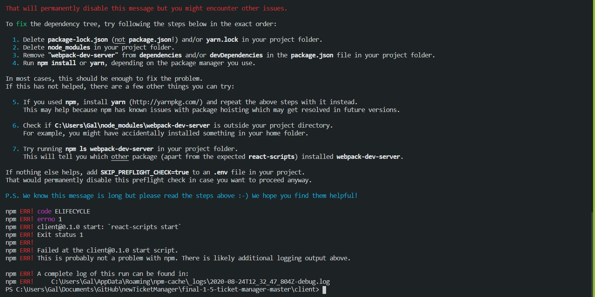
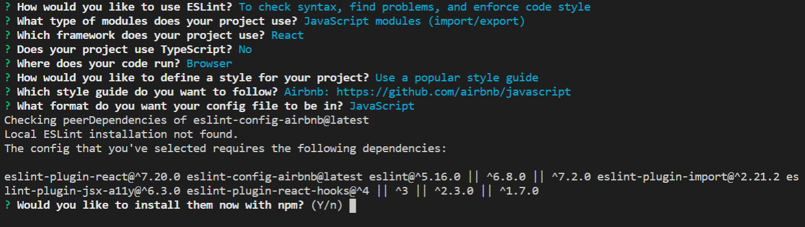

# ESLint for Create-React-App  
if you've ever tried to employ ESlint on a React app created using `npx create-react-app`, chances are you've encountered this error:

DONT PANIC! 
this guide is for you.
# Table of Contents

* [The Problem](#The-Problem)

* [The Cause](#The-Cause)

* [Before you start coding](#before-you-start-coding)

# the Problem
You've created a new app using`npx create-react-app` or you want to lint an older project.  
you install eslint using npx, try to use  `npx eslint --init` to start using it.  
and when you are asked this: 

you merrily enter Y- if it needs these dependencies, why not get them?  
you lint to your heart's content, and try to run `npm start`.  
Then are hit by this Scary looking bastard:  

firstly- no need to panic.  
following the provided instructions you can easily restore it to operating normally-  
`npm start` will work (any linting you already did will remain).  
As it says, usually it only takes the first 

# The Cause
When using `npx create-react-app` you run a script that, among other things, installs many dependencies into your node_modules folder.  
However- counter-intuitively, it will not list most of these libraries in the `package.json` file.  
you can see for yourself- a fresh `create-react-app` project's `package.json` is quite empty. But peek into it's `node_modules` and you'll see folders a plenty.   
The point Being- most of what Eslint asked you to install is already installed- it just can't tell that.

# The Solution
The only library actually missing is [eslint-config-airbnb](https://www.npmjs.com/package/eslint-config-airbnb), which is required for using the airbnb style guide.  
Install it using `npm i eslint-config-airbnb -D` as a dev-dependency.  
Everything should now work as expected.
