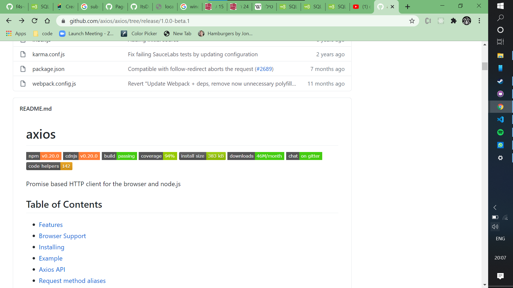
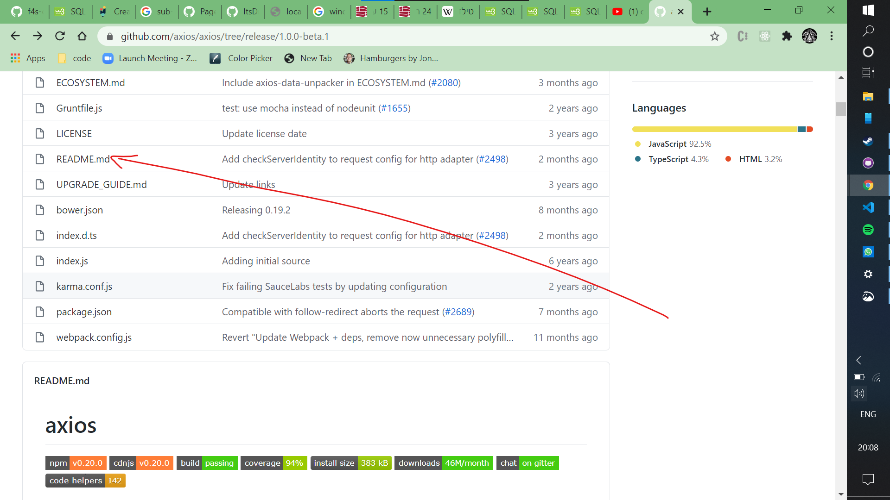
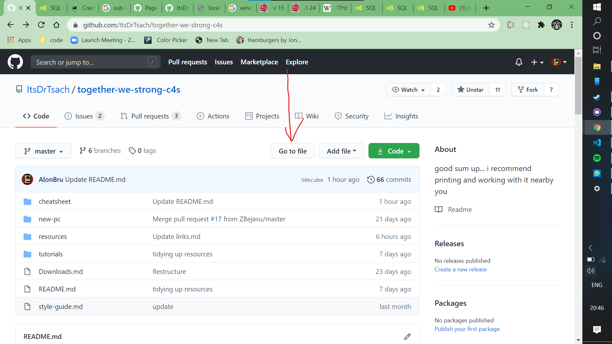
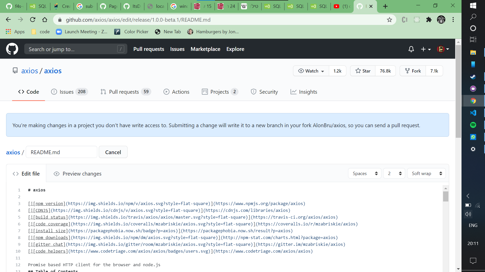
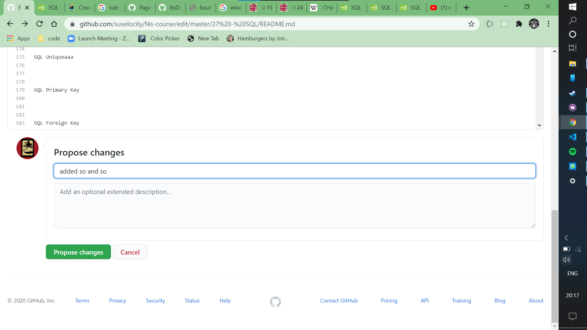
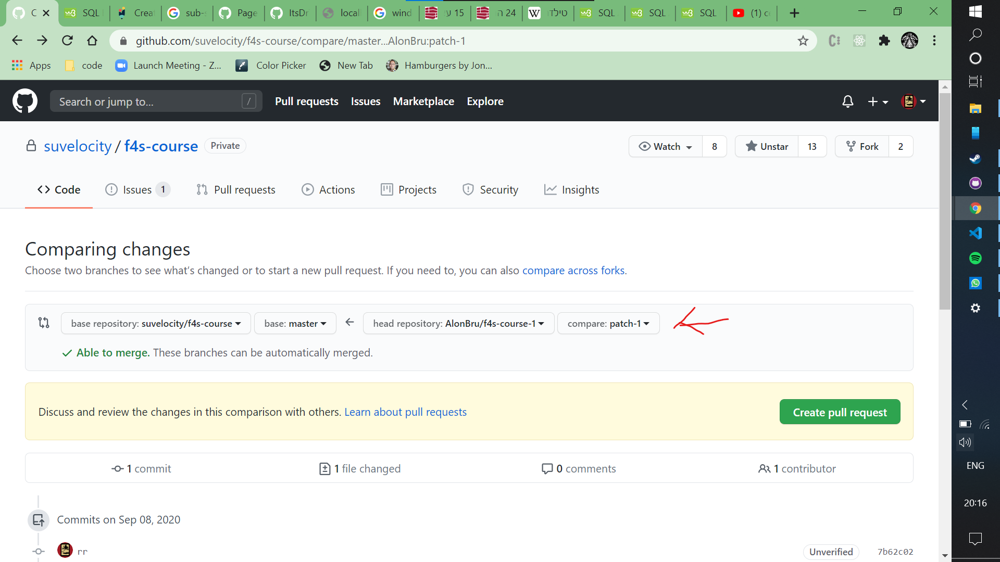
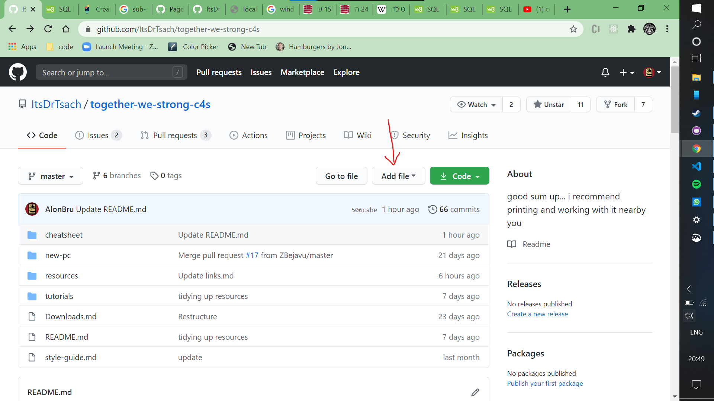
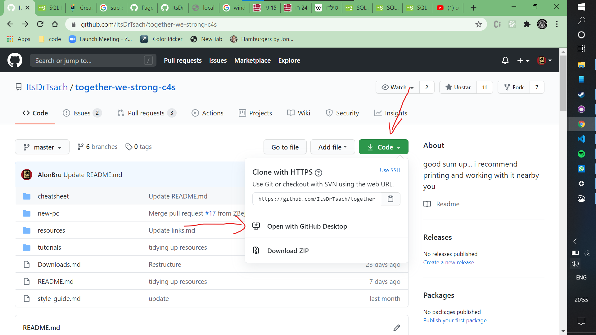

# To contribute to the repo

# Table of Contents 
* [Basic Structure](#basic-structure)
* [To Add a Link](#add-a-link)
* [TO Add a File](#add-a-file)
* [Work with GitHub Desktop](#Github-Desktop)

# Structure
the Repo's basic structure is like this:  

The "start" is the repo's main __README__ file, that you will see when you come into the repo.  
In it you'll find links to the 3 main sub-folders and some general things we decided to keep handy.  

# Add a Link
1. go to the repo you wan to edit.

1. find the file you want to edit.

you can also use the 'search file' button. 

1. click the edit (pencil) button.

1. you should see a similar message to the one in blue.
edit as you see fit.

1. when you are finished, scroll down to this section.  
add a good description to what you did and click "propose changes"

1. here you can see the repo has been forked to your account.
you can review your changes then click "create pull request" to submit it.

1. an admin should shortly review and merge your changes.

# Add a File
1. click "add file", then "upload files". avoid files with spaces in their names, use "_" or "-" instead

1. the rest is quite self explanatory. just add a good description when you submit.

# GitHub Desktop
1. Clone the Repo to your Desktop.

2. Create a new Branch.

3. Open the branch in VSC and edit you branch to your heart's desire, while maintaining the structure and style.  
__Please__ Make use of the [style guide](./style-guide.md).
    * There is a useful option in VSC to preview your .md page as you work. you should be able to see it at the top-right of your workspace. try using ctrl+K then V

4. Try to push/ publish the branch with GitHub desktop, you will see that you can't push it to the Repo.
__DON'T PANIC! that is normal__

    * GitHub desktop will ask if you'd like to instead fork the Repo and publish your branch there. Do it.

    * When you Do it will ask whether to fork for personal use or to contribute. Choose to contribute like the generous soul you are.

    * This will fork the repo to your account, But when you choose to make a pull request it will make it to this Repo here, the OG Repo.

5. When you are done, make a pull request.  
Use the Label __"Addition"__ for additions to the Repo and other labels appropriately, and make it nice and descriptive so the Admins can more easily review and merge your contributions.  
 If your contribution relates to an open issue, please [link your pull-request to that issue](https://docs.github.com/en/github/managing-your-work-on-github/linking-a-pull-request-to-an-issue).

## Hebrew instructions 
(copy this somewhere that can deal with hebrew like MS word)  
view the [style guide](./style-guide.md) before changing anything.
1. עשה clone לריפו
2 צור branch חדש, קרא לו בשם סביר, שיסביר את התרומה שלך (למשל addition to VSC extensions)
3. ערוך את הbranch שלך ככל שתרצה (נא לשמור על המבנה והסגנון הקיימים)
4. נסה לעשות  push/ publish לbranch שלך עם גיטהאב דסקטופ. אתה תראה שלא תוכל לדחוף אותו לריפו. בלי פאניקה! זה אמור לקרות.
•	גיטהאב דסקטופ ישאל אותך אם תרצה במקום זאת לעשות fork לריפו ולעשות publish לbranch שלך שם. עשה זאת.
•	כשתעשה כך הוא ישאל אותך אם לעשות fork לשימוש אישי או כדי לתרום. בחר לתרום כמו הנפש הנדיבה שהינך.
•	כך תעשה fork לריפו לחשבונך, אך כשתבחר לעשות pull request היא תופנה לריפו המקורית שלנו כאן.
5. כשסיימת, עשה  pull request. השתמש בlabel שנקראת addition לתוספות או בלייבלים אחרים אם הם מתאימים. ותוסיף תיאור כדי שנוכל למרג'ג' אותה יותר בקלות. אם היא קשורה לissue פתוח, אנא קשר אותה אליו (https://docs.github.com/en/github/managing-your-work-on-github/linking-a-pull-request-to-an-issue)
