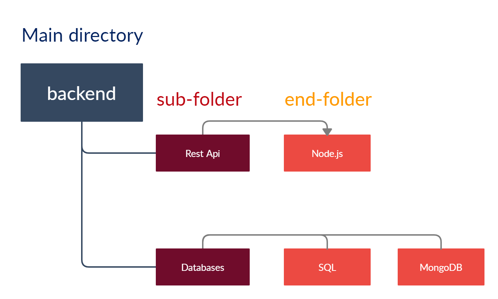
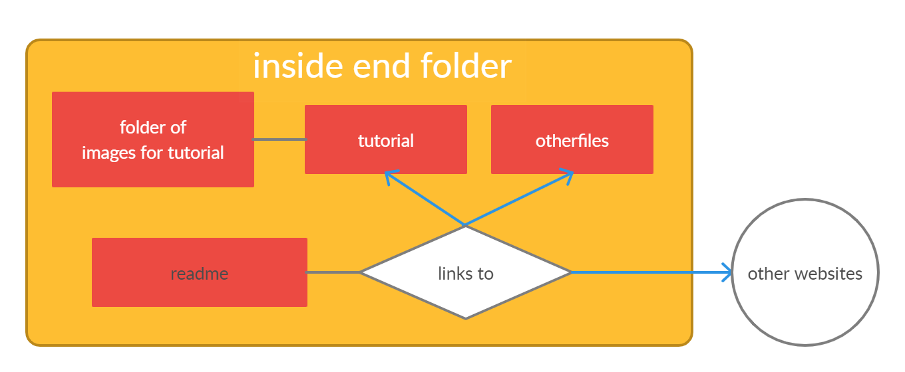

# Style Guide
Here is the guide to editing and adding to the Repo.  
* There is a useful option in VSC to preview your .md page as you work. you should be able to see it at the top-right of your workspace.try using ctrl+K V.
## Here You'll Find
* [Basic MarkDown Syntax](https://docs.github.com/en/github/writing-on-github/basic-writing-and-formatting-syntax)
A guide to Basic markdown used in this page.

* [Structure](#structure)  
An explanation of the Repo's intended structure.

* [README](#README)  
Rules to follow when adding or editing a README file.
* [Write a tutorial yourself](##writing_md_tutorials)  
write a tutorial yourself and add it to the repo.
* [Adding files](add_a_file)  
write a tutorial yourself and add it to the repo.

# Structure
the Repo's basic structure is like this:  


The "start" is the repo's main __README__ file, that you will see when you come into the repo. if a file named readme is in a folder, it will be displayed when you open the folder. 
In it you'll find links to the 3 main folders and some general things we decided to keep handy.  

in the main folder we have sub-folders divided by topics, and a readme file to make navigation easier.
eg. the Software folder's readme [here](Software\README.md).

Sub-folders may themselves be divided as well to more sub-folders, and so on.

 

Eventually we reach an End-folder which will resources for a topic in the form of files, and the end-folder readme to direct you to the different resources, both in the folder and links to the internet.


# README
Every End-directory has a `README.md` file.  
It is a markdown file which acts as the main page of the dir.
it explains its purpose and points with links to the different resources the directory has.

* [Template End-folder readme](./template.md)- just copy, edit and change the name to `readme.md`
* [explained & commented](./explanation.md)- how it works  

# Writing md tutorials
If you want to write a tutorial yourself, use the .md (markdown) format. It has many useful features like adding images, links and styles to your tutorial.  

If you want images in your tutorial, add them neatly in a folder and access like so with '!' : 
````

```` 

### Good guides for md:  
* [GitHub official md guide](https://guides.github.com/features/mastering-markdown/)
* [learn md in 10 minutes](https://medium.com/better-programming/master-markdown-in-ten-minutes-ce9721c51eb)

# Add a File

When I say files, I mean files other than .md. when it comes to adding files-
__try not to__.
It clutters the repo, and makes cloning it to your computer a heavier load.

You should avoid adding a file when you can instead add a link to it.

For instance if there is a really cool VSC extension you think everyone should get, add a link to it in the [vsc extensions](software/general/extensions/VSC_Extensions) directory.

if you do add a file,  add also a link to it in the relevant readme like so:
````
[file name](path/filename.file)
````
for instance: 
````
[image](teach/bylink/searchfile.png)
```` 

will look like: [image](teach/bylink/searchfile.png) and lead to and image by that name in these directories
